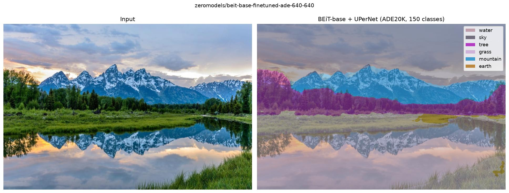

# BEiT

<div class="kf-note kf-note--weights">
<b>Weights:</b> BEiT is hosted in the <a href="https://huggingface.co/collections/zeromodels">zeromodels</a>
BEiT collection; load a checkpoint with <code>from_weights("zeromodels/beit-base-patch16-224")</code>
(classification) or <code>from_weights("zeromodels/beit-base-finetuned-ade-640-640")</code>
(segmentation). Any upstream <code>beit</code> repo also loads on the fly via the <code>hf:</code>
prefix, e.g. <code>from_weights("hf:microsoft/beit-base-patch16-224")</code>. The architecture is
read from the repo config, so no shape arguments are needed.
</div>

BEiT (BERT pre-training of Image Transformers) is a ViT-family vision transformer: a
convolutional patch stem, a learned CLS token, and a stack of pre-norm transformer blocks. It
differs from a vanilla ViT in three ways that every hosted checkpoint uses:

- a **per-layer 2D relative position bias** in attention (and no absolute position embeddings),
- a learnable **layer scale** (`lambda_1` / `lambda_2`) on each residual branch, and
- **mean pooling** of the patch tokens (followed by a LayerNorm) for classification, rather
  than reading the CLS token.

It ships as an ImageNet classifier and, with a UPerNet head, as an ADE20K semantic segmenter.

**Paper**: [BEiT: BERT Pre-Training of Image Transformers](https://arxiv.org/abs/2106.08254)

## API

### BeitImageClassify

```python
BeitImageClassify(
    hidden_size=768,
    num_hidden_layers=12,
    num_attention_heads=12,
    intermediate_size=3072,
    patch_size=16,
    layer_scale_init_value=0.1,
    layer_norm_eps=1e-12,
    image_size=224,
    include_normalization=True,
    normalization_mode="inception",
    num_classes=1000,
    classifier_activation="linear",
    name="BeitImageClassify",
)
```

The classifier: the [BeitModel](#beitmodel) backbone plus the mean-pool head (mean of the patch
tokens, a LayerNorm, then a Dense). `include_normalization=True` takes raw `[0, 255]` pixels and
applies BEiT's 0.5/0.5 normalization internally (`normalization_mode="inception"`).

**Parameters**

- **hidden_size** (`int`, defaults to `768`): transformer width.
- **num_hidden_layers** (`int`, defaults to `12`): number of transformer blocks.
- **num_attention_heads** (`int`, defaults to `12`): attention heads per block.
- **intermediate_size** (`int`, defaults to `3072`): MLP inner dimension.
- **patch_size** (`int`, defaults to `16`): conv-stem patch size.
- **layer_scale_init_value** (`float`, defaults to `0.1`): initial layer-scale value.
- **layer_norm_eps** (`float`, defaults to `1e-12`): epsilon of every LayerNorm.
- **image_size** (`int`, defaults to `224`): resolution the model is built for.
- **num_classes** (`int`, defaults to `1000`): classifier outputs.

`from_weights` fills the architectural fields from the repo config, so you normally pass only
the repo id.

**Call** `model(pixel_values, training=False)`. **Returns** class logits `(B, num_classes)`.

### BeitModel

The backbone alone: the patch stem, CLS token, and transformer blocks, ending at the token
sequence `(B, num_patches + 1, hidden_size)` (the first token is the CLS token). There is no
final backbone LayerNorm (BEiT normalizes only inside the mean-pool head). With
`as_backbone=True` it returns the per-block token sequences (the initial embedding plus one per
block), which the segmentation head reshapes into 2D feature maps.

### BeitSemanticSegment

```python
BeitSemanticSegment(
    hidden_size=768,
    num_hidden_layers=12,
    num_attention_heads=12,
    intermediate_size=3072,
    patch_size=16,
    image_size=640,
    num_classes=150,
    out_indices=(3, 5, 7, 11),
    pool_scales=(1, 2, 3, 6),
    name="BeitSemanticSegment",
)
```

Semantic segmentation: four intermediate token sequences (at `out_indices`) are reshaped into
2D feature maps, rescaled by an FPN neck (4x up, 2x up, identity, 2x down), and decoded by a
**UPerNet** head (pyramid pooling module + FPN fusion) into per-pixel class logits at a quarter
of the input resolution. The training-only auxiliary FCN head is omitted.

**Call** `model(pixel_values, training=False)`. **Returns** segmentation logits
`(B, H/4, W/4, num_classes)` (`channels_last`; the head runs in `channels_last`). Upsample to
the input size and `argmax` over the class axis for a label map.

## Model Variants

Load any of these with `from_weights("zeromodels/<variant>")`.

| Task | Repo | Classes |
|------|------|--------:|
| Classification | `zeromodels/beit-base-patch16-224` | 1000 |
| Classification | `zeromodels/beit-large-patch16-224` | 1000 |
| Classification | `zeromodels/beit-large-patch16-512` | 1000 |
| Classification (22k) | `zeromodels/beit-base-patch16-224-pt22k-ft22k` | 21841 |
| Classification (22k) | `zeromodels/beit-large-patch16-224-pt22k-ft22k` | 21841 |
| Segmentation | `zeromodels/beit-base-finetuned-ade-640-640` | 150 |
| Segmentation | `zeromodels/beit-large-finetuned-ade-640-640` | 150 |

Use `BeitImageClassify` for the classification repos and `BeitSemanticSegment` for the
`finetuned-ade` repos. The upstream `microsoft/beit-*` checkpoints load the same way with the
`hf:` prefix.

## Basic Usage: Classification

```python
import keras
import numpy as np
from PIL import Image
from zeromodels.models.beit import BeitImageClassify

model = BeitImageClassify.from_weights("zeromodels/beit-base-patch16-224")

image = Image.open("assets/data/coco_bear.jpg").convert("RGB").resize((224, 224))
pixels = np.asarray(image, "float32")[None]  # (1, 224, 224, 3), raw [0, 255]

logits = model(pixels, training=False)
top5 = np.argsort(keras.ops.convert_to_numpy(logits)[0])[-5:][::-1]
print("top-5 ImageNet-1k class ids:", top5.tolist())
```

Normalization is inside the model, so pass raw pixels. Map the class ids to the
[ImageNet-1k label list](https://huggingface.co/datasets/imagenet-1k) to read names.

## Semantic Segmentation

Load the hosted segmenter and its processor with `from_weights`, run the image, and turn the
logits into a full-resolution label map with `post_process_semantic_segmentation`:

```python
import os

os.environ["KERAS_BACKEND"] = "torch"  # or "jax" / "tensorflow"

from PIL import Image
from zeromodels.models.beit import BeitSemanticSegment, BeitImageProcessor
from zeromodels.utils.labels_util import ADE20K_150_CLASSES
from zeromodels.utils.visualization_util import plot_segmentation

model = BeitSemanticSegment.from_weights("zeromodels/beit-base-finetuned-ade-640-640")
processor = BeitImageProcessor.from_weights(
    "zeromodels/beit-base-finetuned-ade-640-640"
)

image = Image.open("assets/data/mountain.jpg").convert("RGB")
pixels = processor(image)  # (1, 640, 640, 3), raw [0, 255]; the model normalizes
logits = model(pixels, training=False)  # (1, 160, 160, 150), channels_last
seg = processor.post_process_semantic_segmentation(
    logits,
    target_sizes=[image.size[::-1]],  # (height, width)
)[0]  # (H, W) ADE20K class ids at full resolution

plot_segmentation(image, seg, ADE20K_150_CLASSES)  # overlay + legend
```



The logits come out at a quarter of the input resolution (160x160 for a 640 input);
`post_process_semantic_segmentation` upsamples them (bilinear, before the argmax) to each
`target_sizes` entry and returns one `(H, W)` label map per image. The 150 classes are the ADE20K
label set. The hosted processor only resizes (the model normalizes internally); see
[Image Processor](#image-processor) for the details and the alternative normalizing path.

## Image Processor

`BeitImageProcessor` handles the input resize and the segmentation post-processing, and mirrors
transformers' `BeitImageProcessor` (resize to a square `size` bicubic, rescale `1/255`, normalize
0.5/0.5). It accepts a file path, a PIL image, a `uint8` array, or a `keras`/float pixel tensor,
and returns a `(B, H, W, C)` batch (pass a list for several images). Rescale and normalize are
bit-exact to transformers; the resize matches the fast (torchvision) processor to about `7e-3`
(`antialias=True`).

The hosted segmentation repos ship a `zm_preprocessor.json`, so `from_weights` builds a processor
that matches the model. Because the models bake 0.5/0.5 normalization
(`include_normalization=True`, raw `[0, 255]` pixels in), the hosted processor only **resizes**
(its `do_rescale` / `do_normalize` are off) and provides `post_process_semantic_segmentation`:

```python
processor = BeitImageProcessor.from_weights(
    "zeromodels/beit-base-finetuned-ade-640-640"
)
# do_resize=True (640, bicubic), do_rescale=False, do_normalize=False
```

Constructed directly, the processor defaults to the HF-faithful settings (`do_rescale=True`,
`do_normalize=True`), which pair with a model built `include_normalization=False`:

```python
from zeromodels.models.beit import BeitImageProcessor, BeitImageClassify

processor = BeitImageProcessor(size=224, resample="bilinear")  # normalizes (0.5/0.5)
model = BeitImageClassify.from_weights(
    "zeromodels/beit-base-patch16-224", include_normalization=False
)

pixels = processor("assets/data/coco_bear.jpg")  # (1, 224, 224, 3), normalized
logits = model(pixels, training=False)
```

Either way the result is identical (the normalization just moves between the processor and the
model). `post_process_semantic_segmentation(logits, target_sizes=[(H, W)])` upsamples the
quarter-resolution logits (bilinear, then argmax) and returns a list of per-pixel label maps, one
per image, matching the reference. `BeitImageProcessor.from_hf(preprocessor_config)` builds a
processor straight from a repo's `preprocessor_config.json`.

## Feature Extraction

`BeitModel.from_weights(..., as_backbone=True)` returns the per-block token sequences (the
embedding plus one per transformer block). Drop the CLS token and reshape each to a
`(B, grid, grid, hidden_size)` map to hook a detection or segmentation neck onto:

```python
from zeromodels.models.beit import BeitModel

backbone = BeitModel.from_weights("zeromodels/beit-base-patch16-224", as_backbone=True)
features = backbone(pixels, training=False)  # list of (B, 197, 768) token sequences
```

## Loading Fine-tuned and Community Weights

The official checkpoints live under `zeromodels/`, but any Hugging Face repo whose `model_type`
is `"beit"` also loads on the fly with the `hf:` prefix, including `microsoft/beit-*` and
arbitrary fine-tunes:

```python
from zeromodels.models.beit import BeitImageClassify

model = BeitImageClassify.from_weights("hf:<user>/beit-finetuned-on-my-data")

# Architecture only, randomly initialized
model = BeitImageClassify.from_weights(
    "zeromodels/beit-base-patch16-224", load_weights=False
)
```

The architecture is read from the repo's `config.json` and mapped onto the constructor:
`hidden_size`, `num_hidden_layers`, `num_attention_heads`, `intermediate_size`, `patch_size`,
`image_size`, and the label count. `BeitModel` and `BeitSemanticSegment` accept `hf:` the same
way.
