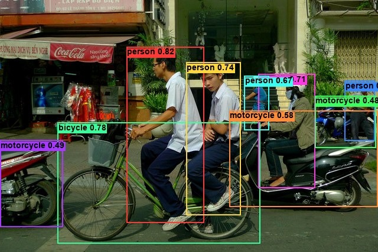
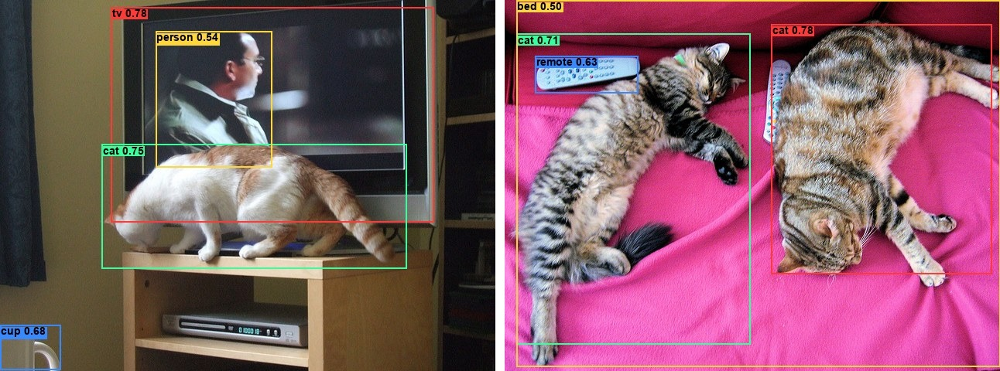

# EfficientDet

<div class="kf-note kf-note--weights">
<b>Weights:</b> pretrained Keras weights live on Hugging Face under
<a href="https://huggingface.co/zeromodels">zeromodels/&lt;variant&gt;</a>
(each repo carries <code>zm_config.json</code> + <code>model.weights.h5</code> +
<code>zm_preprocessor.json</code>), converted from Google AutoML's official COCO release.
Load with <code>from_weights("zeromodels/efficientdet_d0")</code>.
</div>

EfficientDet is a family of single-shot, anchor-based detectors (D0 through D7) built for a clean accuracy/compute trade-off. An EfficientNet backbone produces multi-level features, a **weighted bi-directional feature pyramid (BiFPN)** fuses them top-down then bottom-up with a learnable weight per input, and one shared class head and one shared box head run over every pyramid level. Each spatial location emits nine anchor predictions, decoded against a fixed anchor grid.

Unlike the DETR line, EfficientDet keeps the conventional detector machinery: anchors and non-maximum suppression are part of the pipeline, run after the network in the post-processor. Compound scaling grows the backbone, BiFPN width and depth, head depth, and input resolution together from D0 (3.9 M params, 512²) to D7 (52 M, 1536²).

**Paper**: [EfficientDet: Scalable and Efficient Object Detection](https://arxiv.org/abs/1911.09070)

## API

### EfficientDetDetect

```python
EfficientDetDetect(
    backbone_name="efficientnet_b0",
    image_size=512,
    num_classes=90,
    min_level=3,
    max_level=7,
    num_scales=3,
    aspect_ratios=(1.0, 2.0, 0.5),
    anchor_scale=4.0,
    fpn_num_filters=64,
    fpn_cell_repeats=3,
    box_class_repeats=3,
    act_type="swish",
    separable_conv=True,
    apply_bn_for_resampling=True,
    conv_after_downsample=False,
    conv_bn_act_pattern=False,
    fpn_weight_method="fastattn",
    survival_prob=None,
    name="EfficientDetDetect",
)
```

The detector: EfficientNet backbone, weighted BiFPN, shared class/box heads, and in-graph
anchor decoding. **This is the class for object detection.** Defaults describe
EfficientDet-D0; `from_weights` fills these in from the hosted `zm_config.json` for each
variant, so you rarely pass them by hand.

**Parameters**

- **backbone_name** (`str`, *optional*, defaults to `"efficientnet_b0"`): EfficientNet backbone, `"efficientnet_b0"` through `"efficientnet_b6"`.
- **image_size** (`int`, *optional*, defaults to `512`): input resolution the model is built for. Must be divisible by 128, see [Input Resolution](#input-resolution).
- **num_classes** (`int`, *optional*, defaults to `90`): COCO's 90 category ids (class `c` maps to `COCO_91_CLASSES[c + 1]`; index 0 is the "N/A" id).
- **min_level** / **max_level** (`int`, *optional*, defaults to `3` / `7`): pyramid levels the heads run on, strides 8 to 128.
- **num_scales** (`int`, *optional*, defaults to `3`) / **aspect_ratios** (`tuple`, *optional*, defaults to `(1.0, 2.0, 0.5)`): the anchor grid; `num_scales * len(aspect_ratios)` = 9 anchors per location.
- **anchor_scale** (`float`, *optional*, defaults to `4.0`): base anchor size relative to the level stride (D7 uses `5.0`).
- **fpn_num_filters** (`int`, *optional*, defaults to `64`): BiFPN channel width.
- **fpn_cell_repeats** (`int`, *optional*, defaults to `3`): number of stacked BiFPN cells.
- **box_class_repeats** (`int`, *optional*, defaults to `3`): depth of each shared head.
- **fpn_weight_method** (`str`, *optional*, defaults to `"fastattn"`): BiFPN fusion, `"fastattn"` (normalized ReLU weights), `"attn"` (softmax), or `"sum"` (unweighted; D6/D7 use this).
- **act_type** (`str`, *optional*, defaults to `"swish"`): activation.
- **name** (`str`, *optional*, defaults to `"EfficientDetDetect"`): model name.

**Call** `model(pixel_values, training=False)`. **Returns** a `dict`:

- **boxes** (`(B, N, 4)`): anchor-decoded boxes `[ymin, xmin, ymax, xmax]` in `image_size` pixel coordinates. `N` is the total anchor count (49104 for D0 at 512²).
- **scores** (`(B, N, num_classes)`): per-class sigmoid scores.

Raw output is one decoded box per anchor at every class. Run it through
[post_process_object_detection](#post_process_object_detection) to apply NMS and get
scored, original-image boxes.

### EfficientDetModel

```python
EfficientDetModel(..., name="EfficientDetModel")
```

The backbone, BiFPN, and shared heads without anchor decoding. **Parameters** are identical
to [EfficientDetDetect](#efficientdetdetect), with **name** defaulting to
`"EfficientDetModel"`.

**Returns** a `dict` of raw per-level head outputs, `{"class_outputs", "box_outputs"}`:
lists of `(B, H_l, W_l, num_anchors * num_classes)` and `(B, H_l, W_l, num_anchors * 4)` for
levels `min_level`..`max_level`. Use it when you want the raw pyramid outputs to attach a
custom decoder or loss. It shares its weights with `EfficientDetDetect`, so both load the
same hosted file.

## Preprocessing

### EfficientDetImageProcessor

```python
EfficientDetImageProcessor(
    image_size=512,
    resample="bilinear",
    image_mean=None,
    image_std=None,
    rescale_factor=1 / 255,
    return_tensor=True,
    data_format=None,
)
```

Applies EfficientDet's aspect-preserving letterbox: scale by `image_size / max(height,
width)`, ImageNet-normalize, then zero-pad the bottom and right to a square `image_size`.
The pad is applied **after** normalization, so padded pixels are true zeros.

**Parameters**

- **image_size** (`int`, *optional*, defaults to `512`): square target size. Match the model's `image_size`.
- **resample** (`str`, *optional*, defaults to `"bilinear"`): resize interpolation.
- **image_mean** (`tuple`, *optional*, defaults to `(0.485, 0.456, 0.406)`): per-channel mean.
- **image_std** (`tuple`, *optional*, defaults to `(0.229, 0.224, 0.225)`): per-channel std.
- **rescale_factor** (`float`, *optional*, defaults to `1/255`): applied before normalization.
- **return_tensor** (`bool`, *optional*, defaults to `True`): return backend tensors rather than numpy.
- **data_format** (`str`, *optional*): `"channels_last"` or `"channels_first"`. `None` (default) resolves to `keras.config.image_data_format()`, matching a model built under the same global setting. See [Data Format](#data-format).

**Call** `processor(image)` with a path, a PIL image, an array, or a **list** of any mix.
**Returns** a `dict`:

- **pixel_values** (`(B, H, W, 3)`): the preprocessed images.
- **scales** (`list[float]`): the letterbox scale per image.
- **original_sizes** (`list[(h, w)]`): original sizes, ready to pass as `target_sizes` below.

#### post_process_object_detection

```python
processor.post_process_object_detection(
    outputs,
    threshold=0.3,
    iou_threshold=0.5,
    max_detections=100,
    class_agnostic=True,
    target_sizes=None,
    label_names=None,
)
```

Runs NMS over the decoded boxes and sigmoid scores, then, when `target_sizes` is given,
undoes the letterbox and clips boxes to each original image.

- **outputs**: the `dict` returned by the model.
- **threshold** (`float`, *optional*, defaults to `0.3`): minimum score to keep a detection.
- **iou_threshold** (`float`, *optional*, defaults to `0.5`): NMS IoU threshold.
- **max_detections** (`int`, *optional*, defaults to `100`): cap on detections per image.
- **class_agnostic** (`bool`, *optional*, defaults to `True`): one NMS across all classes, so an object yields a single box. See [NMS Modes](#nms-modes).
- **target_sizes** (`list` of `(height, width)`, *optional*): original image sizes, one per batch element. Omit to leave boxes in `image_size` coordinates.
- **label_names** (`list` of `str`, *optional*): class names. Defaults to COCO's 90 categories.

**Returns** a list with one `dict` per image:

- **scores**: class probability per kept detection.
- **labels**: integer class indices.
- **label_names**: the resolved class names.
- **boxes**: `(x0, y0, x1, y1)` in pixels.

## Model Variants

Every variant is trained on COCO's 90 categories and converted from Google AutoML's
`coco2` release. Load any of them with `from_weights("zeromodels/<variant id>")`.

| Variant id        | Backbone        | Input | Params |
|-------------------|-----------------|------:|-------:|
| `efficientdet_d0` | EfficientNet-B0 |   512 |  3.9 M |
| `efficientdet_d1` | EfficientNet-B1 |   640 |  6.6 M |
| `efficientdet_d2` | EfficientNet-B2 |   768 |  8.1 M |
| `efficientdet_d3` | EfficientNet-B3 |   896 | 12.0 M |
| `efficientdet_d4` | EfficientNet-B4 |  1024 | 20.7 M |
| `efficientdet_d5` | EfficientNet-B5 |  1280 | 33.7 M |
| `efficientdet_d6` | EfficientNet-B6 |  1280 | 51.9 M |
| `efficientdet_d7` | EfficientNet-B6 |  1536 | 51.9 M |

Bigger variants are more accurate and slower. D6 and D7 fuse the BiFPN with an unweighted
sum (`fpn_weight_method="sum"`) instead of the fast-attention weighting D0–D5 use.

## Basic Usage: Object Detection



```python
from PIL import Image
from zeromodels.models.efficientdet import EfficientDetDetect, EfficientDetImageProcessor

model = EfficientDetDetect.from_weights("zeromodels/efficientdet_d0")
processor = EfficientDetImageProcessor.from_weights("zeromodels/efficientdet_d0")

image = Image.open("assets/data/coco_bicycles.jpg").convert("RGB")
inputs = processor(image)

output = model(inputs["pixel_values"], training=False)
# output["boxes"]:  (1, 49104, 4)
# output["scores"]: (1, 49104, 90)

results = processor.post_process_object_detection(
    output, threshold=0.3, target_sizes=inputs["original_sizes"]
)[0]

# Detections come back unordered, so sort by score for readability.
detections = sorted(
    zip(results["scores"], results["label_names"], results["boxes"]),
    key=lambda d: -float(d[0]),
)
for score, name, box in detections:
    print(f"{name:14s} {float(score):.3f}  {[round(float(v)) for v in box]}")
```

```
person         0.819  [214, 79, 345, 378]
bicycle        0.782  [98, 208, 441, 412]
person         0.746  [584, 137, 634, 239]
person         0.743  [315, 106, 407, 364]
person         0.710  [437, 126, 533, 318]
person         0.674  [414, 128, 456, 220]
motorcycle     0.582  [388, 187, 639, 350]
motorcycle     0.493  [0, 238, 107, 384]
motorcycle     0.485  [533, 162, 637, 251]
potted plant   0.342  [209, 32, 295, 189]
motorcycle     0.317  [532, 165, 596, 238]
```

Two riders on the bicycle, the bicycle itself, and the parked motorcycles down the street,
all from a 3.9 M-parameter model. `threshold=0.3` is a reasonable default for D0; raise it to
`0.4`–`0.5` to keep only the confident detections.

### Batch Processing Multiple Images

Pass a list of images and one `target_sizes` entry per image:



```python
from PIL import Image
from zeromodels.models.efficientdet import EfficientDetDetect, EfficientDetImageProcessor

model = EfficientDetDetect.from_weights("zeromodels/efficientdet_d0")
processor = EfficientDetImageProcessor.from_weights("zeromodels/efficientdet_d0")

paths = ["assets/data/coco_cat_tv.jpg", "assets/data/coco_cats.jpg"]
images = [Image.open(p).convert("RGB") for p in paths]

inputs = processor(paths)  # (2, 512, 512, 3)
output = model(inputs["pixel_values"], training=False)

results = processor.post_process_object_detection(
    output, threshold=0.3, target_sizes=[(im.height, im.width) for im in images]
)

for path, result in zip(paths, results):
    print(f"\n{path}")
    detections = sorted(
        zip(result["scores"], result["label_names"], result["boxes"]),
        key=lambda d: -float(d[0]),
    )
    for score, name, box in detections:
        print(f"  {name:10s} {float(score):.3f}  {[round(float(v)) for v in box]}")
```

```
assets/data/coco_cat_tv.jpg
  tv         0.779  [144, 9, 560, 288]
  cat        0.749  [132, 187, 525, 348]
  cup        0.676  [0, 420, 78, 478]
  person     0.536  [201, 40, 352, 216]

assets/data/coco_cats.jpg
  cat        0.779  [345, 31, 630, 355]
  cat        0.714  [16, 44, 318, 446]
  remote     0.635  [40, 72, 173, 120]
  bed        0.504  [15, 0, 640, 474]
```

Every image is letterboxed to the same square, so stacking is always safe; results come back
as per-image lists, not a fixed-width tensor.

## NMS Modes

EfficientDet emits a score for **every** class at every anchor, so a single object can clear
the threshold under more than one label (a dog also read as a cat, a truck also as a car).
How the duplicates are resolved is the post-processor's job:

- **`class_agnostic=True`** (the default, Google's `postprocess_global`): each anchor keeps
  only its single highest-scoring class, then one NMS runs across everything. One object
  yields one box. This is what the examples above use.
- **`class_agnostic=False`** (`postprocess_per_class`): NMS runs independently per class, so
  the same object can surface under several labels. Useful when you want the full per-class
  ranking.

```python
results = processor.post_process_object_detection(
    output, threshold=0.3, class_agnostic=False, target_sizes=inputs["original_sizes"]
)[0]
```

Per-class NMS cannot suppress a dog box and a cat box over the same animal, because they are
different classes; the class-agnostic default collapses them to the higher-scoring one.

## Input Resolution

EfficientDet is Functional, so the input shape is fixed when the model is constructed, and
the anchor grid is generated for that size. Each variant has a native resolution (the table
above), but the **weights are resolution-independent** — the conv, BatchNorm, and separable
weights do not depend on the input size, and the only size-dependent tensor, the anchor grid,
is a computed constant rather than a stored weight. So you can build any variant at any valid
size and load the same checkpoint:

```python
model = EfficientDetDetect.from_weights("zeromodels/efficientdet_d0", image_size=768)
processor = EfficientDetImageProcessor(image_size=768)  # match the model
```

The `image_size=768` kwarg overrides the checkpoint's native 512; the 512-trained weights
load unchanged, and the anchor count scales with the input:

```
512:  49104 anchors   cat 0.78, cat 0.71, remote 0.63, bed 0.50
640:  76725 anchors   cat 0.83, cat 0.73, couch 0.64, remote 0.62
896: 150381 anchors   couch 0.78, cat 0.73, remote 0.73, remote 0.71
```

**The side must be divisible by 128.** The heads run on levels 3 through 7 (strides 8 to
128), so the input has to survive seven halvings cleanly. Every native size (512, 640, 768,
896, 1024, 1280, 1536) qualifies.

**Accuracy is best near the trained resolution.** The model *runs* at any valid size, but
scores and box quality drift as you move away from native (visible above at 640 and 896). For
the best result, run each variant near its native size, or pick the variant whose native size
matches your target.

## Custom Class Names

A model fine-tuned on your own dataset predicts your class indices, not COCO's. Pass the names
through `label_names` so the result reads correctly:

```python
MY_CLASSES = ["cat", "dog", "bird"]

results = processor.post_process_object_detection(
    output,
    threshold=0.3,
    target_sizes=[(image.height, image.width)],
    label_names=MY_CLASSES,
)
```

Custom names are indexed directly by the 0-based class id (`label_names[c]`). The default
COCO list is offset by one instead (`COCO_91_CLASSES[c + 1]`, since index 0 is the "N/A" id),
so the post-processor handles the two cases automatically. Without `label_names` a custom
model is silently mislabeled with COCO names; the integer `labels` are unaffected either way.

## Data Format

**Both the model and the processor support `channels_last` and `channels_first`.** Nothing is
hard-coded to a layout, so the whole pipeline runs either way, and the same weights load into
both — the conv, BatchNorm, and separable-conv weights are layout-independent. Detections are
identical (boxes bit-exact, scores within backend rounding).

They pick the format differently, which is the one thing to keep straight:

| | How it picks the format |
|---|---|
| Processor | A `data_format` kwarg, per instance. `None` (the default) resolves to `keras.config.image_data_format()`. |
| Model | Reads `keras.config.image_data_format()` when it is **constructed**. There is no `data_format` argument. |

### Overriding the processor only

```python
EfficientDetImageProcessor(data_format="channels_last")("photo.jpg")["pixel_values"]
# (1, 512, 512, 3)

EfficientDetImageProcessor(data_format="channels_first")("photo.jpg")["pixel_values"]
# (1, 3, 512, 512)
```

### Switching the whole pipeline

Set the global format before constructing the model, and both sides agree:

```python
import keras

keras.config.set_image_data_format("channels_first")

model = EfficientDetDetect.from_weights("zeromodels/efficientdet_d0")
processor = EfficientDetImageProcessor.from_weights("zeromodels/efficientdet_d0")

inputs = processor(image)
# inputs["pixel_values"] is (1, 3, 512, 512)
output = model(inputs["pixel_values"], training=False)
```

Set it once at the top of a script, since already-built models keep the layout they were
constructed with. The post-processor emits `xyxy` pixel boxes and class indices, which have no
channel axis, so it is not format-sensitive.