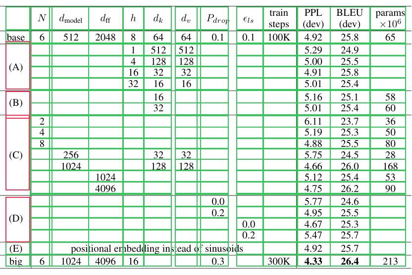
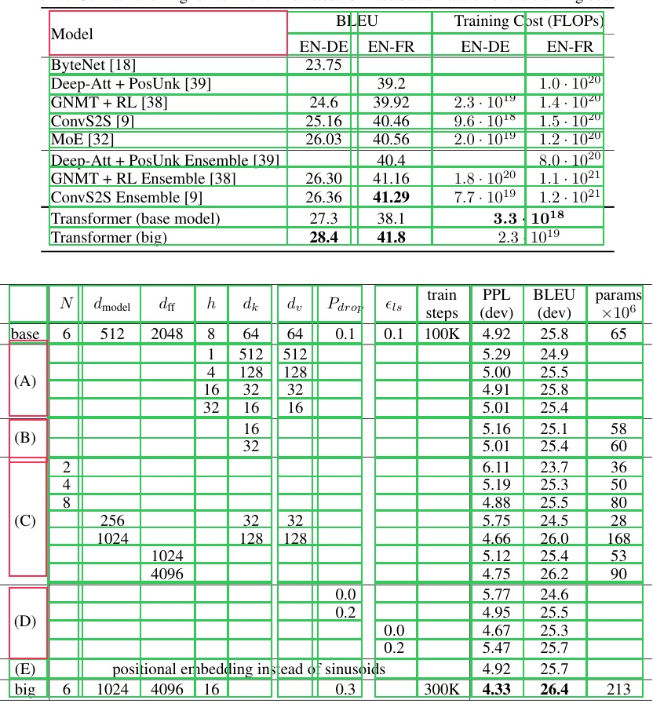

# Table Transformer

<div class="kf-note kf-note--weights">
<b>Weights:</b> pretrained Keras weights live on Hugging Face under
<a href="https://huggingface.co/zeromodels">zeromodels/table-transformer-&lt;variant&gt;</a>
(each repo carries <code>zm_config.json</code>, <code>zm_preprocessor.json</code>, and
<code>model.weights.h5</code>). Load with
<code>from_weights("zeromodels/table-transformer-detection")</code>; the architecture is read
from the repo config, so no shape arguments are needed.
</div>

Table Transformer (TATR) applies the DETR detection recipe to tables. It is the same
end-to-end set-prediction model: a ResNet backbone produces a feature map, a transformer
encoder-decoder attends over it with a fixed set of learned object queries, and each query
emits one class and one box, with no anchors and no non-maximum suppression. It ships in two
tasks, both the same architecture with a different query count and label set:

- **Table detection** finds tables in a page image (classes: table, table rotated).
- **Table-structure recognition** decomposes a cropped table into its cells (classes: table,
  column, row, column header, projected row header, spanning cell).

Two details separate it from DETR: the encoder and decoder layers are **pre-normalized** (the
LayerNorm sits before each attention / feed-forward sub-layer) with an extra final encoder
LayerNorm, and the backbone is a **ResNet-18** (so the 1x1 input projection reduces 512
channels rather than 2048).

**Paper**: [PubTables-1M: Towards comprehensive table extraction from unstructured
documents](https://arxiv.org/abs/2110.00061)

## API

### TableTransformerDetect

```python
TableTransformerDetect(
    hidden_dim=256,
    num_heads=8,
    num_encoder_layers=6,
    num_decoder_layers=6,
    dim_feedforward=2048,
    dropout_rate=0.1,
    num_queries=15,
    num_classes=3,
    image_size=800,
    input_tensor=None,
    name="TableTransformerDetect",
)
```

The detection model: backbone, transformer, and the class and box heads. **This one class
serves both tasks**; only `num_queries` and `num_classes` differ between the checkpoints, and
`from_weights` fills them in from the repo config.

**Parameters**

- **hidden_dim** (`int`, *optional*, defaults to `256`): transformer width, the `d_model` of the HF config.
- **num_heads** (`int`, *optional*, defaults to `8`): attention heads.
- **num_encoder_layers** (`int`, *optional*, defaults to `6`): encoder depth.
- **num_decoder_layers** (`int`, *optional*, defaults to `6`): decoder depth.
- **dim_feedforward** (`int`, *optional*, defaults to `2048`): FFN inner dimension.
- **dropout_rate** (`float`, *optional*, defaults to `0.1`): dropout, active only during training.
- **num_queries** (`int`, *optional*, defaults to `15`): learned object queries, the hard ceiling on detections per image. Detection uses 15, structure recognition 125.
- **num_classes** (`int`, *optional*, defaults to `3`): object classes plus the "no object" class (detection: 2 + 1; structure: 6 + 1).
- **image_size** (`int`, *optional*, defaults to `800`): input resolution the model is built for.
- **input_tensor** (`dict`, *optional*): pre-existing input tensor to build on.
- **name** (`str`, *optional*, defaults to `"TableTransformerDetect"`): model name.

**Call** `model(pixel_values, training=False)`. **Returns** a `dict`:

- **logits** (`(B, num_queries, num_classes)`): per-query class logits.
- **pred_boxes** (`(B, num_queries, 4)`): normalized `(cx, cy, w, h)` in `[0, 1]`.

Raw output is one prediction per query, most of them the "no object" class. Run it through
`post_process_object_detection` to get scored, pixel-space boxes.

### TableTransformerModel

```python
TableTransformerModel(
    hidden_dim=256,
    num_heads=8,
    num_encoder_layers=6,
    num_decoder_layers=6,
    dim_feedforward=2048,
    dropout_rate=0.1,
    num_queries=15,
    image_size=800,
    input_tensor=None,
    name="TableTransformerModel",
)
```

The backbone and transformer without detection heads, ending at the decoder hidden states.
Use it when you want Table Transformer features to attach your own head to.

**Parameters** are identical to [TableTransformerDetect](#tabletransformerdetect), minus
**num_classes**, and **name** defaults to `"TableTransformerModel"`.

**Returns** the decoder's last hidden state, `(B, num_queries, hidden_dim)`.

## Preprocessing

### TableTransformerImageProcessor

```python
TableTransformerImageProcessor(
    size=None,
    resample="bilinear",
    do_rescale=True,
    rescale_factor=1 / 255,
    do_normalize=True,
    image_mean=None,
    image_std=None,
    return_tensor=True,
    data_format=None,
)
```

Resizes to a fixed square, rescales to `[0, 1]`, and normalizes with ImageNet statistics
(the same preprocessing the Table Transformer checkpoints ship with).

**Parameters**

- **size** (`dict`, *optional*, defaults to `{"height": 800, "width": 800}`): target size.
- **resample** (`str`, *optional*, defaults to `"bilinear"`): resize interpolation.
- **do_rescale** (`bool`, *optional*, defaults to `True`): scale pixels to `[0, 1]`.
- **rescale_factor** (`float`, *optional*, defaults to `1/255`): the rescaling factor.
- **do_normalize** (`bool`, *optional*, defaults to `True`): apply mean/std normalization.
- **image_mean** (`tuple`, *optional*, defaults to `(0.485, 0.456, 0.406)`): per-channel mean.
- **image_std** (`tuple`, *optional*, defaults to `(0.229, 0.224, 0.225)`): per-channel std.
- **return_tensor** (`bool`, *optional*, defaults to `True`): return backend tensors rather than numpy.
- **data_format** (`str`, *optional*): `"channels_last"` or `"channels_first"`. Defaults to `keras.config.image_data_format()`.

**Call** `processor(image)` with a path, a PIL image, an array, or a **list** of any mix of
those. **Returns** a `dict` with **pixel_values** (`(B, H, W, 3)`).

**post_process_object_detection**

```python
processor.post_process_object_detection(
    outputs, threshold=0.7, target_sizes=None, label_names=None
)
```

Softmaxes the logits, drops the "no object" class, keeps whatever clears `threshold`, and
converts boxes to pixel-space `(x0, y0, x1, y1)` scaled to `target_sizes`.

- **outputs**: the `dict` returned by the model.
- **threshold** (`float`, *optional*, defaults to `0.7`): minimum class probability.
- **target_sizes** (`list` of `(height, width)`, *optional*): original image sizes, one per batch element.
- **label_names** (`list` of `str`, *optional*): class names. Defaults to the six structure-recognition labels; pass `TABLE_DETECTION_LABELS` for the detection model.

**Returns** a list with one `dict` per image, each holding **scores**, **labels**,
**label_names**, and **boxes** (`(x0, y0, x1, y1)` in pixels).

The module also exports the two label tuples for convenience:

```python
from zeromodels.models.table_transformer.table_transformer_image_processor import (
    TABLE_DETECTION_LABELS,  # ("table", "table rotated")
    TABLE_STRUCTURE_LABELS,  # ("table", "table column", "table row", ...)
)
```

## Model Variants

All variants are ResNet-18 backboned. Load any of them with
`TableTransformerDetect.from_weights("zeromodels/<variant>")`.

| Task                   | Repo                                                           | Queries | Classes |
|------------------------|---------------------------------------------------------------|--------:|--------:|
| Table detection        | `zeromodels/table-transformer-detection`                      | 15      | 2 + 1   |
| Structure recognition  | `zeromodels/table-transformer-structure-recognition`          | 125     | 6 + 1   |
| Structure v1.1 (all)   | `zeromodels/table-transformer-structure-recognition-v1.1-all` | 125     | 6 + 1   |
| Structure v1.1 (fin)   | `zeromodels/table-transformer-structure-recognition-v1.1-fin` | 125     | 6 + 1   |
| Structure v1.1 (pub)   | `zeromodels/table-transformer-structure-recognition-v1.1-pub` | 125     | 6 + 1   |

Detection finds tables in a page image; the structure-recognition variants decompose a
cropped table into its rows, columns, and header / spanning cells (the three v1.1 checkpoints
differ only in their training corpus: all, financial, or publication tables).

## Basic Usage: Table Detection

```python
from PIL import Image
from zeromodels.models.table_transformer import (
    TableTransformerDetect,
    TableTransformerImageProcessor,
)
from zeromodels.models.table_transformer.table_transformer_image_processor import (
    TABLE_DETECTION_LABELS,
)

model = TableTransformerDetect.from_weights("zeromodels/table-transformer-detection")
processor = TableTransformerImageProcessor.from_weights(
    "zeromodels/table-transformer-detection"
)

image = Image.open("page.jpg").convert("RGB")
inputs = processor(image)

output = model(inputs["pixel_values"], training=False)
# output["logits"]:     (1, 15, 3)
# output["pred_boxes"]: (1, 15, 4)

results = processor.post_process_object_detection(
    output,
    threshold=0.9,
    target_sizes=[(image.height, image.width)],
    label_names=TABLE_DETECTION_LABELS,
)[0]

for score, name, box in sorted(
    zip(results["scores"], results["label_names"], results["boxes"]),
    key=lambda d: -float(d[0]),
):
    print(f"{name:14s} {float(score):.3f}  {[round(float(v)) for v in box]}")
```

Each kept detection is a table region in pixel coordinates. Crop the page to those boxes to
get the table images for the next stage.

## Table-Structure Recognition

Structure recognition takes a **cropped table** and predicts its **structure** (six classes:
rows, columns, the column header, projected row headers, and spanning cells), not one box per
cell. That is the difference from cell-detection models such as TableFormer: to get discrete
cells you **intersect the predicted rows and columns** (and keep each spanning cell whole).
The tables below are the real Table 2 and Table 3 from *Attention Is All You Need*
(arXiv:1706.03762), cropped from the paper's PDF pages with the `table-transformer-detection`
checkpoint. Here the ablations table is decomposed into its cells (green), with the
A / B / C / D variation-group labels kept as single spanning cells (red):



```python
from PIL import Image
from zeromodels.models.table_transformer import (
    TableTransformerDetect,
    TableTransformerImageProcessor,
)

model = TableTransformerDetect.from_weights(
    "zeromodels/table-transformer-structure-recognition-v1.1-all"
)
processor = TableTransformerImageProcessor.from_weights(
    "zeromodels/table-transformer-structure-recognition-v1.1-all"
)

table = Image.open("assets/data/attention_table3.png").convert("RGB")
output = model(processor(table)["pixel_values"], training=False)
# output["logits"]:     (1, 125, 7)   six structure classes + no-object
# output["pred_boxes"]: (1, 125, 4)

struct = processor.post_process_object_detection(
    output, threshold=0.6, target_sizes=[(table.height, table.width)]
)[0]


def structure_to_cells(struct):
    """One box per cell, from the predicted rows x columns (spanning cells kept whole)."""

    def kind(name):
        return [
            [float(v) for v in box]
            for box, n in zip(struct["boxes"], struct["label_names"])
            if n == name
        ]

    rows = sorted(kind("table row"), key=lambda b: b[1])
    cols = sorted(kind("table column"), key=lambda b: b[0])
    spans = kind("table spanning cell")

    def spanned(box):
        cx, cy = (box[0] + box[2]) / 2, (box[1] + box[3]) / 2
        return any(s[0] <= cx <= s[2] and s[1] <= cy <= s[3] for s in spans)

    grid = [[c[0], r[1], c[2], r[3]] for r in rows for c in cols]
    return [b for b in grid if not spanned(b)] + spans


cells = structure_to_cells(struct)
print(f"{len(cells)} cells")
```

```
260 cells
```

The raw prediction has **13** `table column`, **21** `table row`, **1** `table column header`,
and **4** `table spanning cell` boxes (read them off `struct["label_names"]`). Intersecting the
13 columns with the 21 rows gives a 273-cell grid; dropping the 17 grid cells covered by the
four A / B / C / D spanning cells and adding those 4 spans back yields the **260** cells drawn
above. The column-header and spanning-cell classes then tell you which cells are headers or
span multiple rows / columns.

### Batch of Multiple Tables

Pass a list of table crops and one `target_sizes` entry per image. Every image is resized to
the same square, so stacking is always safe and the batch result is identical to running the
images one at a time. Here the paper's results table (Table 2) and ablations table (Table 3)
are decomposed into cells together (reusing `structure_to_cells` from above):



```python
from PIL import Image

paths = ["assets/data/attention_table2.png", "assets/data/attention_table3.png"]
images = [Image.open(p).convert("RGB") for p in paths]

inputs = processor(paths)  # (2, 800, 800, 3)
outputs = model(inputs["pixel_values"], training=False)

results = processor.post_process_object_detection(
    outputs, threshold=0.6, target_sizes=[(im.height, im.width) for im in images]
)
for path, struct in zip(paths, results):
    print(path, len(structure_to_cells(struct)), "cells")
```

```
assets/data/attention_table2.png 59 cells
assets/data/attention_table3.png 260 cells
```

The results table (5 x 12) and the ablations table (13 x 21) are decomposed together, and each
image's cells match running it on its own.

## Data Format

**Both the model and the processor support `channels_last` and `channels_first`.** They pick
the format differently:

| | How it picks the format |
|---|---|
| Processor | A `data_format` kwarg, per instance. `None` (the default) resolves to `keras.config.image_data_format()`. |
| Model | Reads `keras.config.image_data_format()` when it is **constructed**. There is no `data_format` argument. |

Set the global format before constructing the model, and both sides agree:

```python
import keras

keras.config.set_image_data_format("channels_first")
model = TableTransformerDetect.from_weights("zeromodels/table-transformer-detection")
# now expects (B, 3, H, W)
```

Detections are identical under either layout; only the tensor shape changes. The
post-processor emits `xyxy` pixel boxes and class indices, which have no channel axis, so it
takes no `data_format` kwarg.

## Loading Fine-tuned and Community Weights

The `zeromodels/table-transformer-*` repos above are pre-converted. Any **other** Hugging Face
repo whose `model_type` is `"table-transformer"` (the upstream `microsoft/table-transformer-*`
checkpoints, or a community fine-tune) loads with the `hf:` prefix, converting on the fly:

```python
from zeromodels.models.table_transformer import TableTransformerDetect

model = TableTransformerDetect.from_weights("hf:<user>/my-table-transformer-finetune")

# Architecture only, randomly initialized
model = TableTransformerDetect.from_weights(
    "zeromodels/table-transformer-detection", load_weights=False
)
```

No shape arguments are needed. The architecture is read from the repo's `config.json` and
mapped onto the constructor: `d_model`, `encoder_attention_heads`, `encoder_layers`,
`decoder_layers`, `encoder_ffn_dim`, `num_queries`, and the label count. `TableTransformerModel`
loads the same way, warm-starting the backbone and transformer from the detector's weights.
